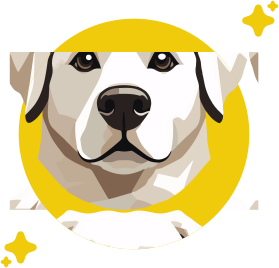

<div style="text-align: center;">

# TerraChat



</div>

TerraChat is an innovative open-source API designed to revolutionize the developer experience by providing seamless access to multiple leading Large Language Models (LLMs) without any rate limitations.

Our goal is to utilize free tokens from various vendors to offer a cost-effective and versatile chat and API solution.

## Key Features

- **Experience TerraChat**: Benefit from an open-source LLMs API that eliminates rate limits, offering an unprecedented developer experience.
- **Unified API Solution**: Our Blackbox API facilitates smooth integration with a wide array of LLMs, providing a one-stop solution for all your needs.
- **Enhanced User Interface**: TerraChat includes an advanced chatbot application that ensures an intuitive and engaging user experience.
- **Diverse LLM Integration**: Easily connect with top models such as Mistral AI, Google Gemini, Cohere, xAI, and OpenAI, with more integrations planned for the future.
- **Smart Switching**: Utilize our sophisticated LLM switch algorithm to optimize performance and flexibility, adapting to the best available model as per your needs.

## Setup

Follow these steps to set up and run TerraChat on your local machine:

1. **Install Dependencies**:

   ```bash
   pip install poetry
   poetry install
   npm install -g pnpm
   cd frontend
   pnpm install
   ```

2. **Start the Python Server**:

   ```bash
   poetry run python server.py
   ```

3. **Start the Frontend Server**:
   ```bash
   cd frontend
   pnpm dev
   ```

Once started, the application will be accessible at `http://localhost:5173`.

## Alternative Start Option

You can also run the project using the `start_terrachat` script:

```bash
./start_terrachat.sh
```

This script will handle all necessary steps to start the application.

## Grant Access to Mixtral-8x7B Model

To use the Mixtral-8x7B model, you need to grant access on Hugging Face. Follow this link to request access:

[Mixtral-8x7B Model on Hugging Face](https://huggingface.co/mistralai/Mixtral-8x7B-v0.1)

We use the Mixtral-8x7B model for generating embeddings, which are essential for the functionality of TerraChat. Once access is granted, you can integrate this model into TerraChat.

## Get Involved

Join our community of developers and contribute to the evolution of TerraChat. Whether you're interested in enhancing the API, improving the UI, or expanding model integrations, your input and collaboration are invaluable.

For questions or more information, feel free to reach out.
